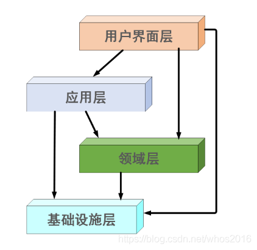
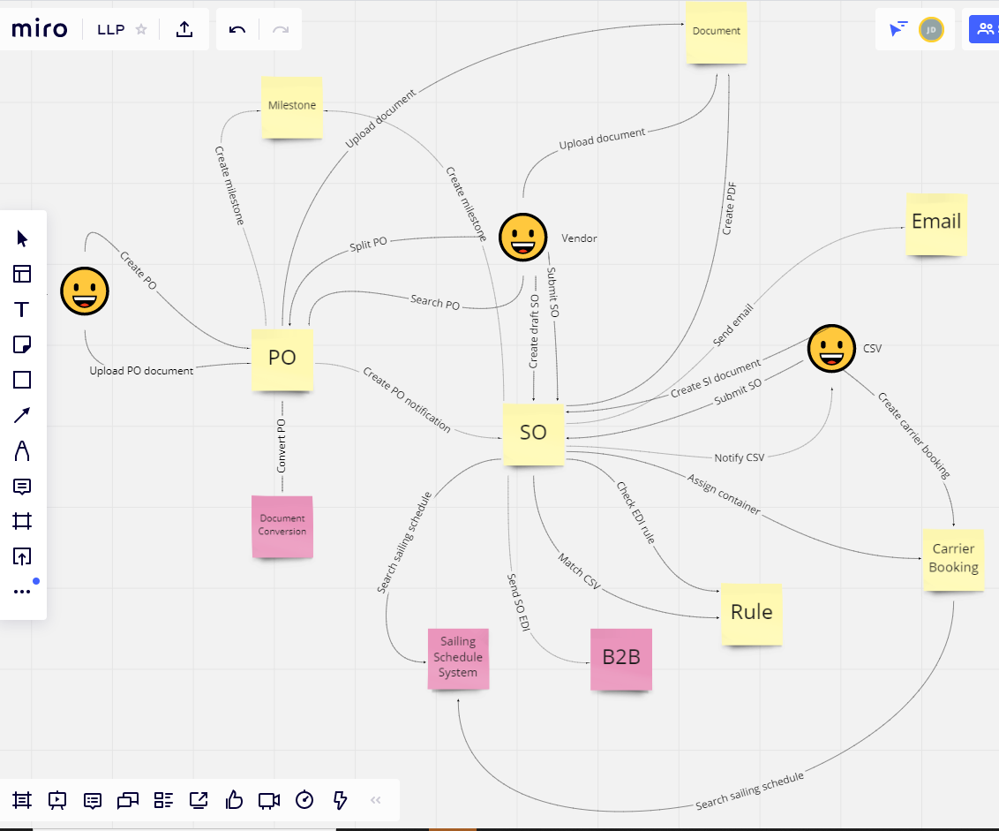
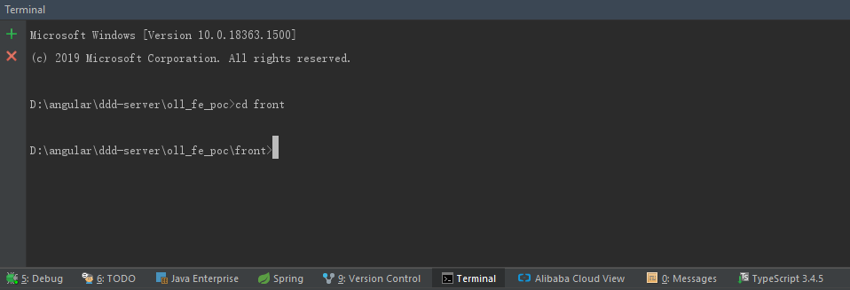
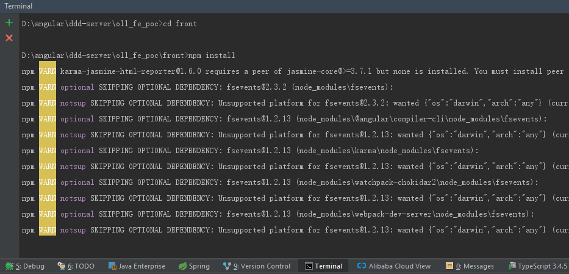
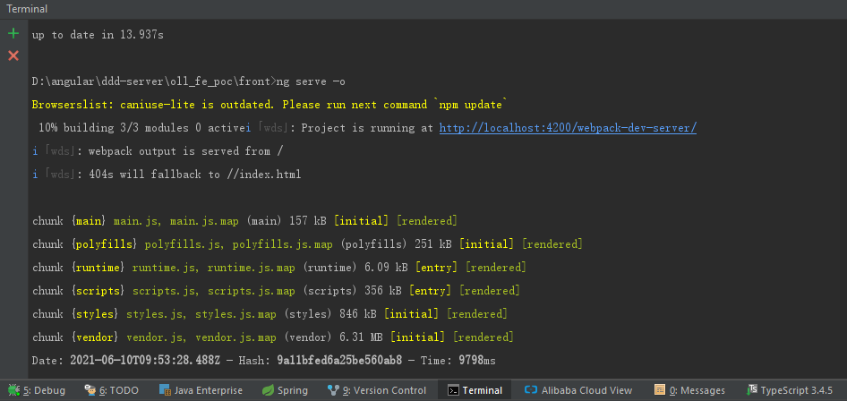

# Frontend POC
#How to run
if you are run this project firs time, you need to follow "Installation for first time" firstly.

1. run buildjs.bat 
2. run OLLFePocApplication.java from IDE

#Setup Email Service in local
https://github.com/Nilhcem/FakeSMTP  
FakeSMTP is a Free Fake SMTP Server with GUI for testing emails in applications easily. It is written in Java.

# 4 layers architecture (Domain Driven Design)

#####Interface --> application | domain | infrastructure
#####application --> domain | infrastructure
#####domain --> infrastructure

RestAPI document:
http://localhost:8080/swagger-ui.html

#installation for first time
0. manual create folder 
front/dist/ddd-console 
1.install nvm & nodejs  
中文文档: https://www.cnblogs.com/gaozejie/p/10689742.html 
 
English: https://github.com/coreybutler/nvm-windows
 
Note:version of nodejs should greater than or equal to v10.16.3
 
 
2.cd front  
In Terminal window run 'cd front' command 
 
 

3.npm install 
In Terminal window run 'npm install' command to install packages 
 
 

4. install angualr cli
>npm install -g @angular/cli

#Start Front end for development mode
ng serve -o 
In Terminal window run 'ng serve -o' command to run the application 
 
 

#About lombok
In this poc project, we introduced lombok plugin to simplify the coding work, it's cool, 
however as a third-party plugin, it's not supported in subsequent Java Version, 
so we don't suggest to use it in formal project.